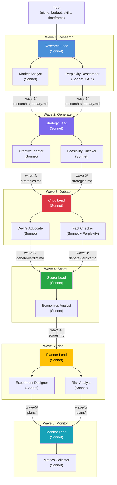
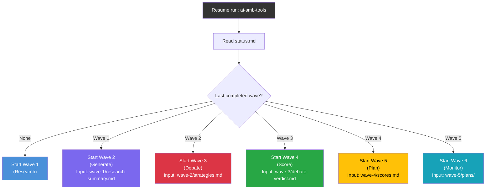
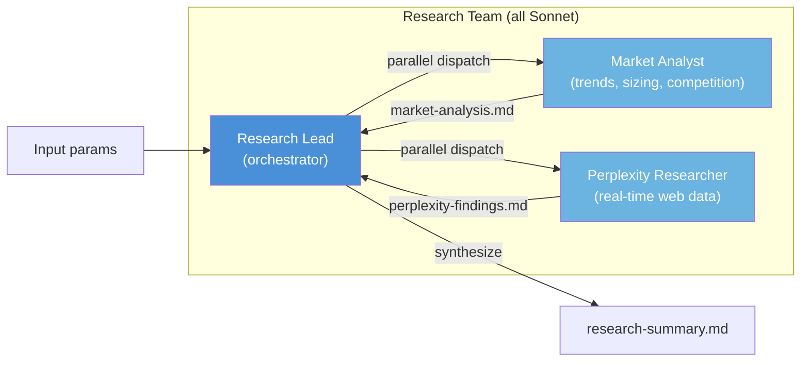
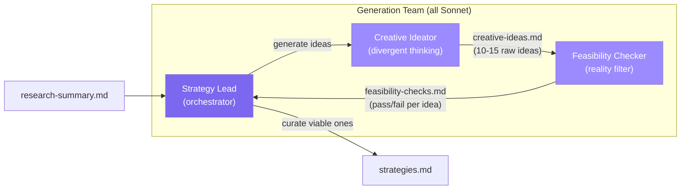
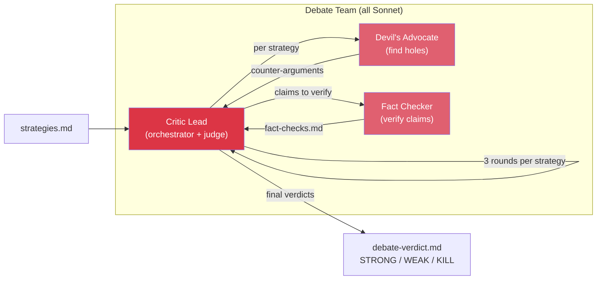
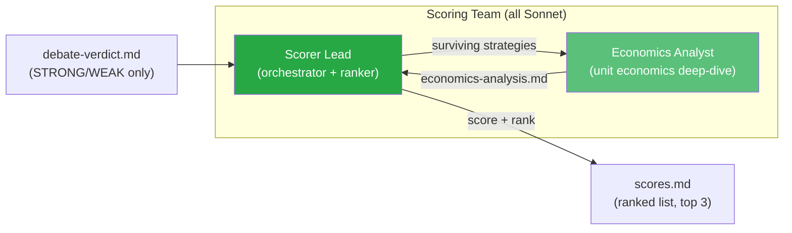
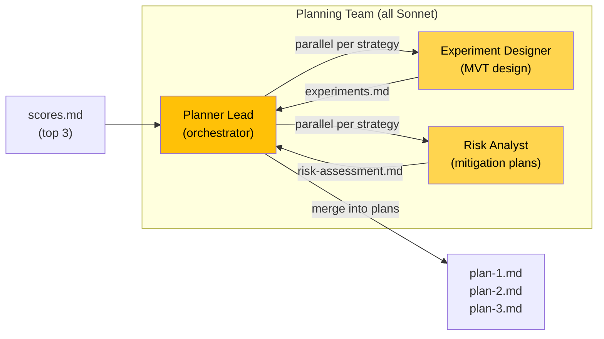
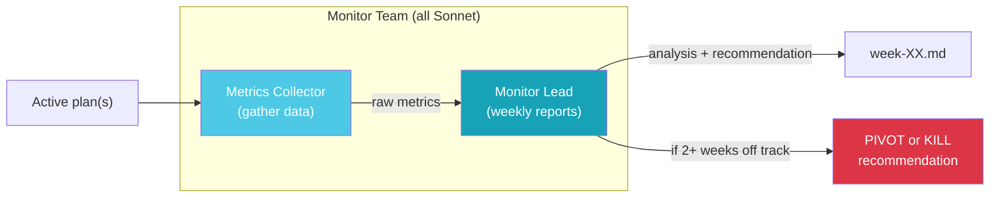
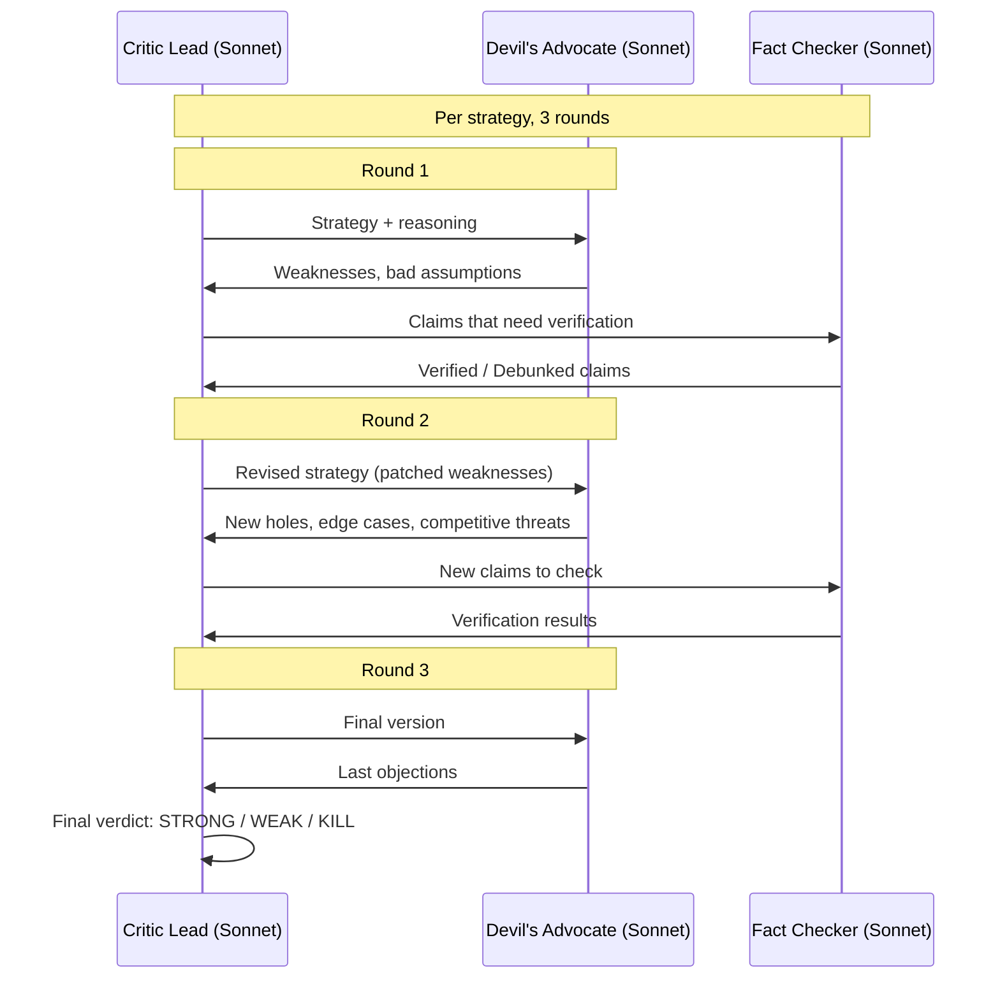

# Idea Judge: Multi-Agent Strategy Evaluation System

**Date:** 2026-04-26
**Status:** Proposal
**Author:** Dionisis / DionAi

---

## Problem

Αξιολόγηση business ideas και money-making strategies είναι manual, biased, και slow. Χρειάζεται ένα σύστημα που:

- Παράγει στρατηγικές grounded σε πραγματικά data
- Τις κρίνει adversarially (όχι confirmation bias)
- Κάνει real-world research validation
- Βγάζει actionable plans
- Παρακολουθεί execution
- **Κάνει resume από οποιοδήποτε σημείο** αν διακοπεί

## Design Principles

- **Model:** Όλοι οι agents τρέχουν σε **Sonnet** (cost-efficient, fast, good enough για analysis)
- **Teams, not solos:** Κάθε wave τρέχει agent team (lead + support agents), όχι μεμονωμένο agent
- **Wave-based persistence:** Κάθε stage γράφει output σε dedicated wave folder. Resume = διάβασε τελευταίο completed wave, συνέχισε από το επόμενο

---

## Proposed Architecture: Reality-First + Adversarial Pipeline

Συνδυασμός δύο patterns: ξεκινάμε από data (όχι από assumptions) και κάθε ιδέα περνάει adversarial stress-test πριν γίνει plan.

### Pipeline Overview



---

## Wave System

Κάθε run έχει unique name (π.χ. `ai-smb-tools`) και folder structure με waves. Κάθε wave γράφει τα αποτελέσματά του σε files. Resume = βρες ποιο wave ολοκληρώθηκε τελευταίο, ξεκίνα το επόμενο.

### Folder Structure

```
projects/idea-judge/
  runs/
    ai-smb-tools/                    # unique run name
      input.md                       # original input parameters
      status.md                      # current wave + status (RUNNING/PAUSED/COMPLETE)
      
      wave-1-research/
        _status.md                   # COMPLETE | IN_PROGRESS | PENDING
        market-analysis.md           # Market Analyst output
        perplexity-findings.md       # Perplexity Researcher output
        research-summary.md          # Research Lead synthesis (WAVE OUTPUT)
        
      wave-2-generate/
        _status.md
        creative-ideas.md            # Creative Ideator raw output
        feasibility-checks.md        # Feasibility Checker output
        strategies.md                # Strategy Lead final list (WAVE OUTPUT)
        
      wave-3-debate/
        _status.md
        round-1.md                   # First adversarial round
        round-2.md                   # Second round
        round-3.md                   # Third round
        fact-checks.md               # Fact Checker findings
        debate-verdict.md            # Critic Lead final verdicts (WAVE OUTPUT)
        
      wave-4-score/
        _status.md
        economics-analysis.md        # Economics Analyst breakdown
        scores.md                    # Scorer Lead rankings (WAVE OUTPUT)
        
      wave-5-plan/
        _status.md
        experiments.md               # Experiment Designer output
        risk-assessment.md           # Risk Analyst output
        plan-1.md                    # Top strategy plan (WAVE OUTPUT)
        plan-2.md                    # Runner-up plan (WAVE OUTPUT)
        plan-3.md                    # Third plan (WAVE OUTPUT)
        
      wave-6-monitor/
        _status.md
        week-01.md
        week-02.md
        ...
```

### Resume Logic



### Status File Format (`status.md`)

```markdown
# Run Status: ai-smb-tools
- **Status:** IN_PROGRESS
- **Current Wave:** 3 (Debate)
- **Last Completed:** Wave 2 (Generate) at 2026-04-26T15:30:00
- **Created:** 2026-04-26T14:00:00
```

### Wave Status File Format (`_status.md`)

```markdown
# Wave 2: Generate
- **Status:** COMPLETE
- **Started:** 2026-04-26T14:45:00
- **Completed:** 2026-04-26T15:30:00
- **Agents Used:** Strategy Lead, Creative Ideator, Feasibility Checker
- **Output File:** strategies.md
- **Strategies Generated:** 8
- **Passed Feasibility:** 6
```

---

## Agent Teams (Detail)

Κάθε wave τρέχει ένα team. Ο Lead orchestrate, οι support agents τρέχουν parallel όπου γίνεται.

### Wave 1: Research Team



| Agent | Role | Tools |
|-------|------|-------|
| **Research Lead** | Orchestrate research, synthesize findings, write summary | Read/Write files |
| Market Analyst | Analyze market trends, competition density, revenue benchmarks | Perplexity API |
| Perplexity Researcher | Real-time web search for specific data points | Perplexity API |

**Parallel:** Market Analyst + Perplexity Researcher τρέχουν ταυτόχρονα. Lead περιμένει και τους δύο, μετά synthesize.

### Wave 2: Generation Team



| Agent | Role | Focus |
|-------|------|-------|
| **Strategy Lead** | Orchestrate, curate final list | Quality control, coherence |
| Creative Ideator | Divergent thinking, generate many ideas | Volume, creativity, unexpected angles |
| Feasibility Checker | Reality-check each idea | Effort estimation, technical feasibility, budget fit |

**Sequential:** Ideator first (volume), then Feasibility Checker (filter), then Lead (curate).

### Wave 3: Debate Team



| Agent | Role | Focus |
|-------|------|-------|
| **Critic Lead** | Run debate rounds, judge quality, write verdicts | Overall assessment, final call |
| Devil's Advocate | Attack every assumption, find weaknesses | Worst-case scenarios, competitive threats |
| Fact Checker | Verify specific claims with real data | Market claims, revenue assumptions, competitor data |

**3-round loop:** Per strategy, Critic Lead sends to Devil's Advocate, gets counter-arguments, sends claims to Fact Checker, then iterates. After 3 rounds: STRONG / WEAK / KILL.

### Wave 4: Scoring Team



| Agent | Role | Focus |
|-------|------|-------|
| **Scorer Lead** | Score on 5 axes, rank, select top 3 | Multi-dimensional ranking |
| Economics Analyst | Deep-dive unit economics per strategy | Revenue/cost modeling, margins, break-even |

**Scoring matrix:**

| Axis | Weight | Description |
|------|--------|-------------|
| Revenue Potential | 25% | Πόσο μπορεί να βγάλει ρεαλιστικά |
| Time to Money | 25% | Πόσο γρήγορα βγαίνει το πρώτο euro |
| Effort Required | 20% | Πόσο effort χρειάζεται (inverse) |
| Risk Level | 15% | Πόσο ρίσκο υπάρχει (inverse) |
| Scalability | 15% | Πόσο κλιμακώνεται χωρίς proportional effort |

### Wave 5: Planning Team



| Agent | Role | Focus |
|-------|------|-------|
| **Planner Lead** | Create week-by-week execution plans | Milestones, tasks, resources, kill criteria |
| Experiment Designer | Design minimum viable test per strategy | Smallest possible validation experiment |
| Risk Analyst | Identify risks + mitigation strategies | What can go wrong, contingency plans |

**Parallel:** Experiment Designer + Risk Analyst τρέχουν ταυτόχρονα per strategy. Lead merges output.

### Wave 6: Monitor Team



| Agent | Role | Focus |
|-------|------|-------|
| **Monitor Lead** | Weekly analysis, compare vs targets, recommend actions | On-track/off-track assessment |
| Metrics Collector | Gather execution data, progress, outcomes | Data collection from various sources |

---

## Adversarial Debate Loop (Detail)



---

## Full System Data Flow

```mermaid
flowchart TD
    subgraph "Run: ai-smb-tools"
        direction TB
        
        subgraph W1["Wave 1: Research"]
            W1_IN["input.md"] --> W1_TEAM["3 agents parallel"]
            W1_TEAM --> W1_OUT["research-summary.md"]
        end
        
        subgraph W2["Wave 2: Generate"]
            W2_IN["research-summary.md"] --> W2_TEAM["3 agents sequential"]
            W2_TEAM --> W2_OUT["strategies.md"]
        end
        
        subgraph W3["Wave 3: Debate"]
            W3_IN["strategies.md"] --> W3_TEAM["3 agents, 3 rounds"]
            W3_TEAM --> W3_OUT["debate-verdict.md"]
        end
        
        subgraph W4["Wave 4: Score"]
            W4_IN["debate-verdict.md"] --> W4_TEAM["2 agents"]
            W4_TEAM --> W4_OUT["scores.md (top 3)"]
        end
        
        subgraph W5["Wave 5: Plan"]
            W5_IN["scores.md"] --> W5_TEAM["3 agents parallel"]
            W5_TEAM --> W5_OUT["plan-1/2/3.md"]
        end
        
        subgraph W6["Wave 6: Monitor"]
            W6_IN["active plan"] --> W6_TEAM["2 agents weekly"]
            W6_TEAM --> W6_OUT["week-XX.md"]
        end
    end
    
    W1_OUT --> W2_IN
    W2_OUT --> W3_IN
    W3_OUT --> W4_IN
    W4_OUT --> W5_IN
    W5_OUT --> W6_IN

    style W1 fill:#E8F0FE,stroke:#4A90D9
    style W2 fill:#EDE7F6,stroke:#7B68EE
    style W3 fill:#FDECEA,stroke:#DC3545
    style W4 fill:#E8F5E9,stroke:#28A745
    style W5 fill:#FFF8E1,stroke:#FFC107
    style W6 fill:#E0F7FA,stroke:#17A2B8
```



---

## Agent Count Summary

| Wave | Lead | Support | Total | Parallel? |
|------|------|---------|-------|-----------|
| 1. Research | Research Lead | Market Analyst, Perplexity Researcher | 3 | Yes (support agents) |
| 2. Generate | Strategy Lead | Creative Ideator, Feasibility Checker | 3 | Sequential |
| 3. Debate | Critic Lead | Devil's Advocate, Fact Checker | 3 | Per round |
| 4. Score | Scorer Lead | Economics Analyst | 2 | Sequential |
| 5. Plan | Planner Lead | Experiment Designer, Risk Analyst | 3 | Yes (support agents) |
| 6. Monitor | Monitor Lead | Metrics Collector | 2 | Sequential |
| **Total** | **6** | **10** | **16** | |

All agents: **Sonnet**. Cost per full run: ~16 agent invocations across 6 waves.

---

## Implementation Plan

### Phase 1: Prototype (1-2 weeks)

Build ως Claude Code skill στο DionAi repo.

```
.claude/skills/idea-judge/
  SKILL.md                    # skill definition + trigger words
  prompts/
    wave-1-research/
      lead.md                 # Research Lead system prompt
      market-analyst.md       # Market Analyst prompt
      perplexity.md           # Perplexity Researcher prompt
    wave-2-generate/
      lead.md
      creative-ideator.md
      feasibility-checker.md
    wave-3-debate/
      lead.md
      devils-advocate.md
      fact-checker.md
    wave-4-score/
      lead.md
      economics-analyst.md
    wave-5-plan/
      lead.md
      experiment-designer.md
      risk-analyst.md
    wave-6-monitor/
      lead.md
      metrics-collector.md

.claude/agents/
  idea-judge-orchestrator.md  # main orchestrator agent definition
```

```
projects/idea-judge/
  README.md
  runs/
    {run-name}/               # e.g., ai-smb-tools
      input.md
      status.md
      wave-1-research/
        _status.md
        ...
      wave-2-generate/
        _status.md
        ...
      (etc.)
  monitoring/
    {run-name}/
      week-01.md
      ...
```

**Leverages existing infra:**
- Perplexity researcher (Wave 1 support)
- Claude Code Agent tool with `model: "sonnet"` for all agents
- File-based persistence (waves enable resume)

### Phase 2: Hardening (if Phase 1 proves value)

- Migrate σε Step Functions + Lambda pipeline
- DynamoDB για structured data
- Automated weekly monitoring via scheduled agents
- Dashboard (optional)

### Phase 3: Scale

- Multiple parallel evaluation pipelines
- Historical data analysis (ποια patterns κερδίζουν)
- Auto-suggest νέες ιδέες βάσει past wins

---

## Why This Design

| Decision | Reasoning |
|----------|-----------|
| Sonnet for all agents | Cost-efficient, fast. Analysis tasks don't need Opus. |
| Teams not solos | Multiple perspectives per stage. Lead synthesizes, support agents specialize. |
| Wave-based persistence | Resume from any point. Inspect intermediate results. Debug specific stages. |
| File-based storage | Simple, readable, git-trackable. No infra needed for Phase 1. |
| Unique run names | Multiple runs coexist. Compare results across different inputs. |
| _status.md per wave | Orchestrator knows exactly where to resume. |
| WAVE OUTPUT files | Clear contract between waves. Next wave reads previous wave's output file. |

---

## Example Run

**Trigger:** `/idea-judge ai-smb-tools "AI-powered tools for small businesses, 500 EUR budget, Python/AI/web dev skills, 8 weeks"`

| Wave | Duration | What happens |
|------|----------|-------------|
| 1. Research | ~2 min | 3 agents scan market. Output: research-summary.md |
| 2. Generate | ~2 min | 3 agents ideate + filter. Output: strategies.md (8 strategies, 6 feasible) |
| 3. Debate | ~5 min | 3 agents, 3 rounds per strategy. Output: 2 STRONG, 3 WEAK, 1 KILL |
| 4. Score | ~1 min | 2 agents score surviving 5. Output: top 3 ranked |
| 5. Plan | ~3 min | 3 agents build execution plans. Output: plan-1/2/3.md |
| 6. Monitor | ongoing | Weekly checks once execution starts |

**Total time (Waves 1-5):** ~13 minutes
**Resume example:** Run crashes at Wave 3. Rerun reads `status.md`, sees Wave 2 = COMPLETE, starts Wave 3 fresh using `wave-2-generate/strategies.md`.

---

## Next Steps

1. **Decide:** go/no-go σε Phase 1
2. **Build:** skill definition + agent prompts (2-3 sessions)
3. **Test:** πρώτο run σε real topic
4. **Iterate:** refine prompts βάσει output quality
